# 预算友好的Horde部署：小团队的性价比基础设施方案

**来源：** Unreal Fest Bali 2025  
**演讲者：** Ash (S1T2公司首席实时开发工程师)  
**视频时长：** 43分47秒  
**生成时间：** 2025-12-28

---

## 摘要

本文介绍了如何为小团队部署Epic的Horde持续集成平台，在保持低成本的同时满足团队需求。演讲者分享了S1T2公司在实际部署中的经验，包括如何选择云服务、配置本地代理、集成第三方服务等成本优化策略。通过混合部署方案（云端核心服务 + 本地构建代理），团队成功降低了基础设施成本，同时保持了系统的稳定性和可扩展性。

---

## 一、引言与背景

大家好，我是Ash，S1T2公司的首席实时开发工程师。我的主要工作是领导基于Unreal Engine的沉浸式交互体验开发，同时也负责维护和开发这些项目的DevOps流水线。

S1T2主要面向画廊、博物馆等机构创建沉浸式和交互式体验，主要使用Unreal Engine。由于工作的实验性质、时间紧迫以及需要适应不断变化的需求，我们非常重视快速迭代。团队规模较小，但会根据项目需要与承包商或其他合作伙伴扩展。团队采用混合工作模式，成员可能在家办公、在办公室工作，或在其他国家现场工作，因此远程访问工具和基础设施非常重要。

本次演讲面向对Horde感兴趣但不确定是否适合自己团队的小型团队，以及尚未建立持续集成的团队。虽然了解Horde或类似工具会有所帮助，但即使不了解也没关系。

---

## 二、什么是Horde？

Horde是Epic Games定制的持续集成平台，甚至可以说它不仅仅是一个持续集成平台。Horde的独特之处在于它对Unreal工具、项目和流程的原生支持。它原生支持构建图（Build Graph），并与Unreal Gamesync等其他Epic工具集成。Horde的设计考虑了大规模部署，能够满足Epic这样规模团队的需求。

### 为什么选择Horde？

**开箱即用的体验**：对于Unreal Engine项目，Horde的开箱即用体验是无与伦比的，这得益于其原生集成和简化的流程。

**一体化解决方案**：Horde自带大部分所需功能，减少了在不同工具或服务之间创建"胶水代码"的需要。

**Unreal生态系统**：选择Horde意味着融入Unreal工具生态系统和Epic的工作方式，这降低了在流程或流水线中引入更多Epic工具的摩擦。

**可扩展性**：如果你是一个全球规模的团队，Horde非常有意义，因为它能够满足这种规模团队的需求。

### 为什么不选择Horde？

**工作流限制**：Horde在其工作流和集成方面比较"固执己见"，如果你不同意这些方式或它们不适合你，可能不是正确的选择。

**Perforce依赖**：Horde的一个集成是Perforce，你需要找到集成它的方法或迁移到Perforce，这可能不值得付出努力。

**非Unreal项目**：如果你的工作室混合使用Unreal和非Unreal项目，Horde对非Unreal项目的支持会较少。

**已有系统**：如果你已经有一个正常工作的系统，可能很难证明迁移的必要性。

---

## 三、Horde部署需求概述

### Epic的Horde部署规模

根据Horde文档，Epic的部署包括：Amazon负载均衡器、Linux容器、服务仪表板、12个Horde服务、DocumentDB、ElastiCache、数百个运行Horde代理的EC2实例，以及100台本地机器。这展示了Horde设计所面向的规模。

### 最小化部署需求

作为小团队，我们显然不需要所有这些。最小化的Horde部署包括：

1. **Horde服务器**：与MongoDB和Redis数据库配对（或兼容的替代品）
2. **仪表板服务**：用于提供Web界面
3. **存储后端**：用于存储构建产物和日志（可以是本地文件系统或云存储）
4. **至少一个代理**：用于实际运行任务
5. **Perforce服务器**：包含项目、引擎和Horde配置

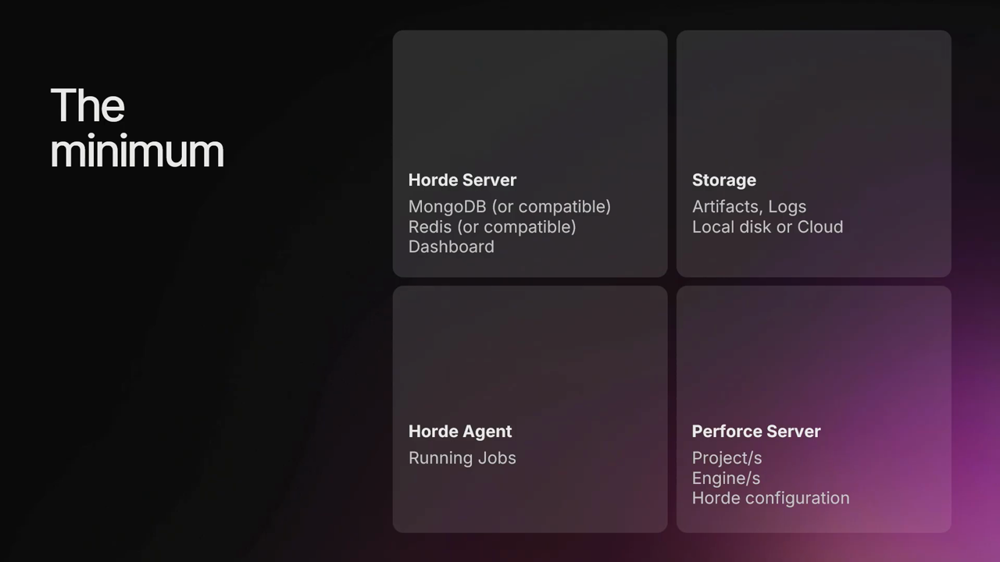

### 可选的外部服务

还有一些可以扩展Horde功能的外部服务：

- **认证提供者**：提供登录流程和用户管理
- **通知服务**：Horde开箱即用支持Slack通知
- **问题系统**：可以集成Jira（本次不讨论）**

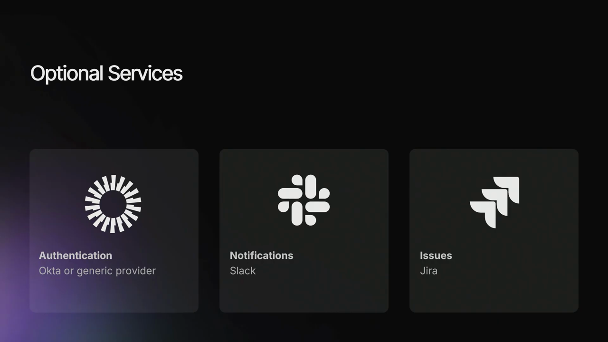

---

## 四、部署策略选择

### 部署位置选择

在决定部署位置时，我们有几个选项：完全云端、完全本地，或混合方案。

**本地部署**：
- 优点：长期可能更便宜，可以一次性购买硬件而不是持续支付云托管费用
- 缺点：更难扩展，不能一键启动更多服务器；可能不如云部署稳定，更容易受到断电、网络中断和硬件故障的影响

**云端部署**：
- 优点：提供出色的可扩展性和按需扩展能力；可能更稳定，大规模中断不常见，硬件故障不再是问题
- 缺点：长期可能更昂贵

**混合部署**：
- 优点：可以结合两者的优势，提供灵活性
- 缺点：可能不是最便宜的选项，但可以提供两全其美

### 我们的选择：混合部署

我们选择了混合部署方案：

1. **云端关键基础设施**：存储、数据库、服务器等关键组件放在云端，以确保稳定性
2. **本地代理**：构建代理放在本地，通过购买硬件或重新利用已有硬件来节省成本，而不是为高性能云服务器支付持续费用
3. **第三方服务**：使用免费的认证和通知服务

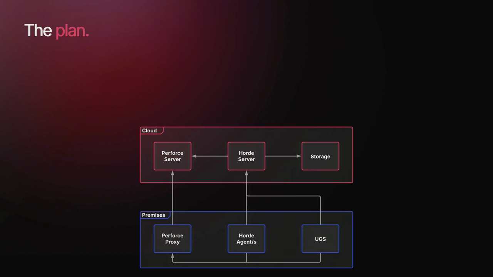

---

## 五、Horde服务器部署详解

### 服务器架构选择

Horde服务器需要部署四个组件：Horde服务器本身、MongoDB和Redis数据库，以及用于提供仪表板的服务。

作为起点，我们可以参考Epic的部署，考虑AWS提供的托管数据库：DocumentDB和ElastiCache。这些托管数据库旨在作为Mongo和Redis的即插即用替代品，自带高可用性和自动备份等额外功能，提供更简化的体验，但代价是成本增加。

**方案一：自管理EC2实例**

我们可以将Mongo和Redis直接部署到自管理的EC2实例上。虽然需要更多工作来实现自动扩展或备份等功能，但这种基础设施仍然为未来的扩展留有余地，即使需要手动操作。

**方案二：单EC2实例 + Docker（我们选择的方案）**

我们可以更进一步，配置单个EC2实例，然后使用Docker运行所有需要的服务。虽然这个选项很便宜（只需支付一台服务器），但它提供的灵活性最少。如果将来想要扩展，需要将所有内容迁移到新服务器。

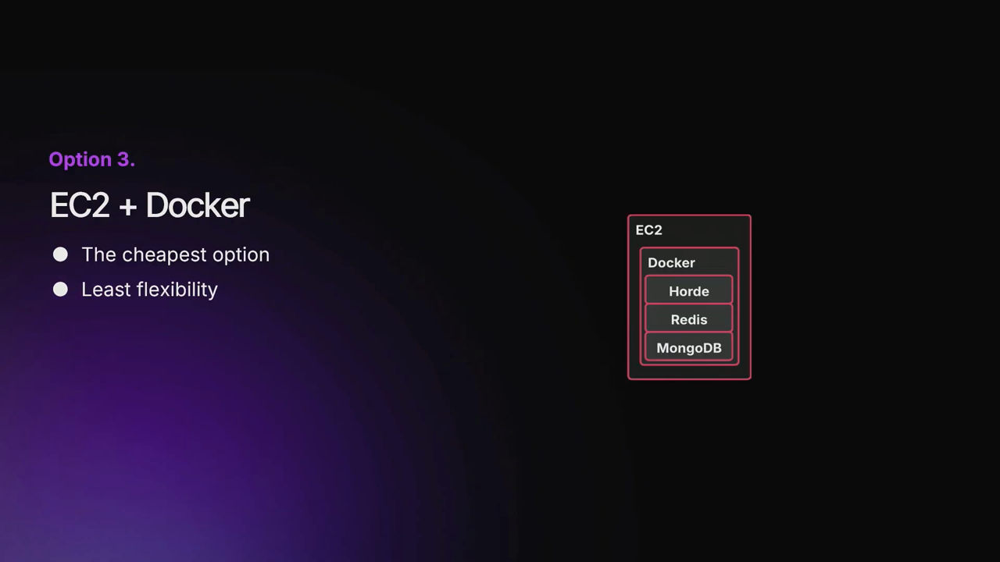

我们选择了EC2和Docker选项，通过只配置一台服务器来节省一些资金。虽然失去了水平扩展的能力，但对于小团队来说，这不是必需的。

### 仪表板服务

仪表板只是一个静态站点，这给了我们很多选择。我们可以使用几乎任何现成的服务器，AWS也为此提供了解决方案。但我们也可以直接使用Horde服务器。虽然我们可以将这项工作卸载到其他地方，但影响很小，而且会增加部署的复杂性。

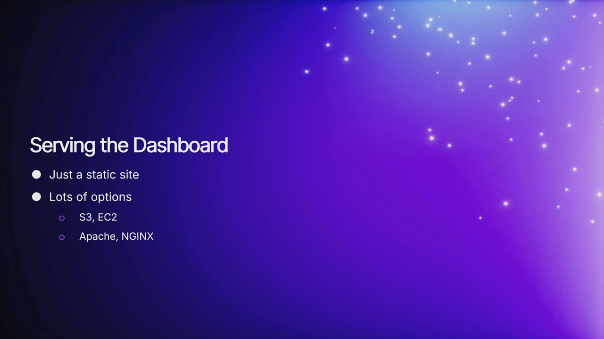

单独托管仪表板的唯一真正好处是，我们可以在不部署整个新镜像到Horde服务器的情况下部署仪表板的新更新。

---

## 六、存储后端选择

Horde会生成几种不同类型的文件需要存储，包括构建产物（如打包构建）和运行任务的日志。

Horde支持多个存储后端，可以是外部云解决方案（如Amazon S3或Azure Blob存储），也可以使用EC2实例的本地存储（在这种情况下是分配给它的EBS卷）。

### EBS vs S3

**EBS卷**：
- 需要分配一定数量的存储，如果用完需要分配更多或删除数据
- 可以提供比S3更好的I/O性能（假设没有其他瓶颈）
- 每GB通常比S3更昂贵

**S3（我们选择的方案）**：
- 没有存储限制，按使用付费
- **主要优势**：Horde可以使用预签名URL，这意味着客户端可以直接上传和下载数据到S3，绕过Horde服务器
- 这允许我们拥有更精简的Horde服务器

我们选择S3是因为它更便宜、没有存储限制，但预签名URL功能是这里的主要优势。

---

## 七、构建代理配置

### 硬件选择建议

在硬件方面，一些要求是显而易见的：

- **多核心CPU**：核心越多，可以并行处理的任务越多
- **快速存储**：代理会读写大量文件，SSD强烈推荐，以防止成为瓶颈
- **GPU（可选）**：取决于你是否计划在这些代理上运行自动化测试以及测试的类型
- **足够的内存**：需要足够的RAM来满足所有核心的需求

### 内存配置

如果你曾经编译过Unreal Engine项目，你可能见过这样的消息：它说每个逻辑核心限制一个进程，在这种情况下是20个。然后它请求每个进程1.5GB内存，目前只有25GB可用。所以它被限制为16个进程，而不是最大20个。

这意味着代理没有足够的可用RAM来饱和所有核心。仅仅为代理添加更多核心是不够的。

我通常建议为每个线程预算约2GB的RAM，这将提供充足的缓冲。你真正需要的是每个线程1.5GB加上一点缓冲。

### 代理配置优化

这个限制器是人工的，可以关闭。它可能有助于代理没有足够RAM的情况，但最好确保它们首先有足够的RAM。

我们在构建代理上禁用了这个限制器，以防内存使用出现峰值。我们希望确保它们始终使用最大数量的并行操作。

还有一个"all cores"布尔值，当某些构建图任务在Horde代理上运行时，它被设置为true，但不是所有任务。我们希望将其设置为true。

---

## 八、Perforce服务器配置

### 基本要求

在可以实际运行CI任务之前，我们需要设置Perforce服务器。有两个主要要求：

1. **Unreal Engine源代码必须在Perforce上**：即使你不打算修改它，我们也需要将一些工作投入到如何构建Perforce流来接收引擎源代码。

2. **项目必须是"原生"的**：这本质上是一个必须遵循的文件夹结构。

### Stream配置

我们想创建至少两个流。第一个是入口点，只包含未修改的Unreal Engine。然后我们将创建另一个流，我们可以在其中实际开发更改。

我还建议创建第三个流作为两者之间的缓冲区。这将为我们提供一个地方来合并传入的更改与我们自己的修改。

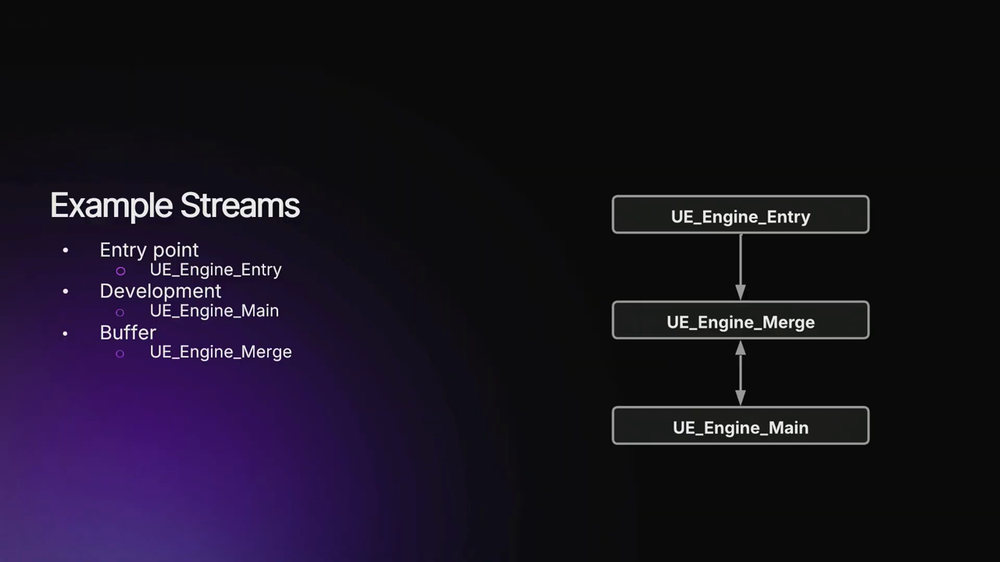

### 原生文件夹结构

我们的项目必须被认为是"原生"的，我们需要满足两个标准之一：

1. 项目文件夹必须相对于引擎目录
2. 如果它在子目录中，该子目录需要列在`.uproject`文件中

### Stream Components

我们可以使用Stream Components来实现这一点。这允许我们为项目创建一个单独的流，然后我们可以将该流的内容映射到为引擎创建的任何工作区。这样，如果你同步引擎流，你也会在子目录中获得项目。

使用Stream Components的好处是它解耦了引擎和项目流，意味着它们可以独立混合匹配或合并和分支。另一个好处是它可以追溯应用甚至撤销，而不必在不同流之间推送文件，提供了很大的灵活性。

### Perforce代理

我们可以通过引入Perforce代理来改进设置。Perforce代理本质上充当客户端和Perforce服务器之间的缓存。如果代理已经有客户端请求的文件，我们不需要从服务器重新下载该文件。这可以改善同步时间，并减少Perforce服务器上的负载。

我们想要实现的是让代理与Perforce代理通信，但Horde服务器直接与Perforce服务器通信。为了实现这一点，我们需要一个在每个机器上解析到不同IP的主机名。在代理上，这个主机名将解析到Perforce代理的IP，在Horde服务器上，它将解析到Perforce服务器的IP。

对于代理，我们可以通过在hosts文件中添加条目来实现。在服务器上，我们可以通过在docker-compose文件的extra_hosts字段中添加条目来做类似的事情。

---

## 九、Unreal Gamesync集成

### 什么是Unreal Gamesync？

Unreal Gamesync是一个桌面工具，其主要目的是简化从Perforce同步引擎和项目所涉及的步骤。它带有额外功能，如同步过滤器和从Perforce或Horde下载预编译二进制文件的能力。它被设计和意图用于我们之前讨论的原生文件夹结构。

### 为什么使用Unreal Gamesync？

Unreal Gamesync自动化了同步所涉及的所有步骤。在一个点击中，我们可以同步、构建和运行项目，这有助于减轻这些步骤中的人为错误。

你还可以将Unreal Gamesync视为启动器或仪表板。一眼就能看到项目、变更列表等，并启动其他工具如Unreal Insights。当然还有预编译二进制文件，我们能够同步和运行项目，甚至不需要安装Visual Studio。

### 使用Horde集成Gamesync

传统上，这需要专用的元数据服务器，并将二进制文件存储在Perforce上。我们需要在Perforce服务器上创建两个额外的流，一个用于Unreal Gamesync二进制文件，一个用于预编译编辑器二进制文件。

但现在，我们可以使用Horde来完成所有这些。Horde现在是我们的元数据服务器，也存储这些二进制文件。我们少了一台服务器需要部署，不需要在Perforce服务器上创建任何额外的流。

配置Unreal Gamesync非常简单，我们只需要在INI文件中添加这个条目。上传预编译二进制文件也很简单，在我们的构建图脚本中，我们有一个产生我们想要上传的二进制文件的节点，然后我们可以添加这个artifact元素来查找这些二进制文件。如果我们分配正确的类型和键，Unreal Gamesync将自动能够找到并下载它们。

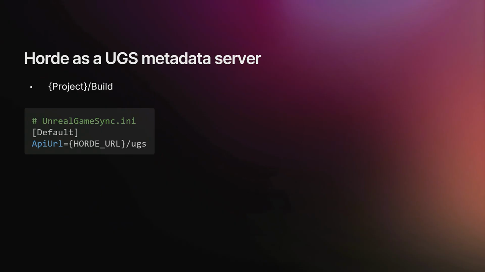

---

## 十、认证系统配置

### OIDC基础

OIDC代表OpenID Connect，这是一个提供两个主要目的的标准：

1. **登录流程**：允许用户登录你的服务，可能使用他们在其他平台（如Google或GitHub）上创建的账户
2. **用户身份**：一旦登录，你的服务将接收有关用户的信息，如他们的姓名或电子邮件地址

### Horde的登录流程

Horde有两个主要的登录流程需要理解：

**仪表板登录**：如果你浏览到Horde服务器，它基本上会立即将你重定向到提供商的登录页面。在那里填写详细信息并登录，你将被重定向回Horde仪表板，处于已登录状态。

**桌面工具登录**：当Unreal Gamesync想要进行身份验证时，它首先托管一个带有网页的本地HTTP服务器，然后它将打开浏览器到提供商的登录页面。登录后，这次你将被重定向到本地托管的网页，Unreal Gamesync将看到它已被重定向，然后将接收到的信息存储在文件中以供以后使用。

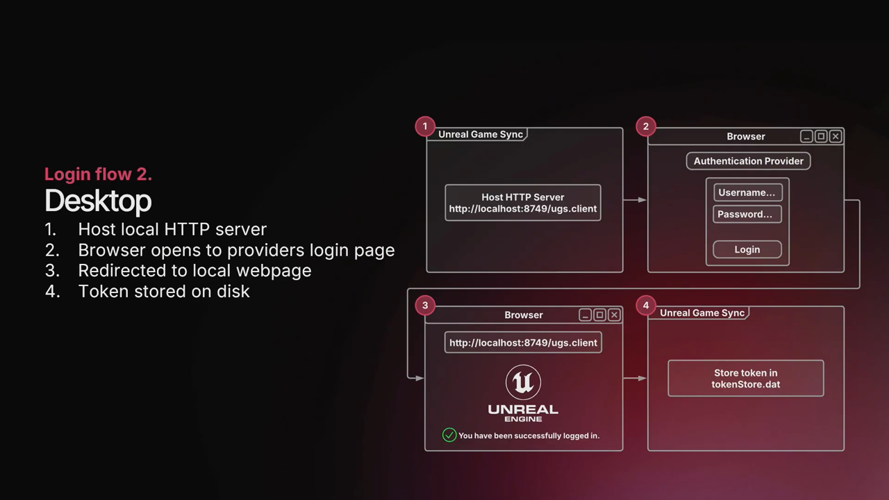

### 用户身份和权限

当用户登录Horde时，它将接收描述用户的声明列表。声明只是键值对，可以是他们的电子邮件地址、姓名、个人资料图片等。在Horde中，我们还可以为这些声明分配权限。例如，如果用户的电子邮件声明是`ash@s1t2.com`，那么他们可以拥有"执行Horde命令"权限。

### 选择认证提供者

有很多提供者可以选择，其中很多需要付费。Horde确实有一个内置提供者，如果你不打算将Horde服务器暴露到互联网，这绝对是一个很好的选择。它也更容易设置，而且是免费的。

我们选择的提供者是Auth0。它是免费使用的，非常宽松，在开始付费之前可以有25,000个用户，这对我们来说肯定足够了。它拥有S1T2所需的所有功能，但对我们来说的一个杀手级功能是它与Google Workspace集成，这意味着我们可以使用现有的Google S1T2 Workspace账户登录，这非常方便。

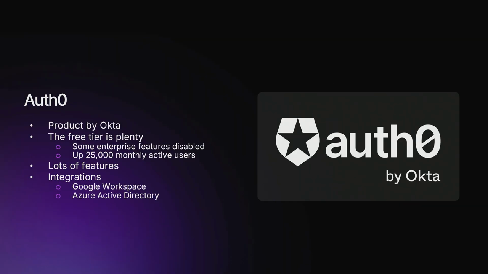

### Auth0配置步骤

在服务器配置文件中，我们需要填写六个字段来设置身份验证：Auth方法、OIDC授权和受众、客户端ID和密钥，以及我们的服务器URL。

1. **Auth方法**：选择"OpenID Connect"
2. **OIDC授权**：在Auth0中创建账户时，首先需要创建租户，生成的URL就是我们用于授权的
3. **受众**：需要创建API，标识符就是我们用于受众的
4. **客户端ID和密钥**：需要创建应用，选择"单页Web应用程序"，设置允许的回调URL，然后在应用设置中找到客户端ID和密钥
5. **服务器URL**：设置为Horde服务器的域名

### Auth0安全设置

在Auth0中，我们还需要进行一些更改：

1. **限制访问**：
   - 禁用Google社交连接（默认启用，意味着任何拥有Google账户的人都可以登录）
   - 禁用用户名和密码身份验证的注册（防止任何人自己创建登录）

2. **默认受众**：设置默认受众很重要。设置Auth提供者后，你可能会发现登录仪表板工作正常，但登录桌面工具（如Unreal Gamesync）不太正常。这是因为Auth0期望在其有效负载之一中有受众参数，但Unreal Gamesync实际上没有提供它。我们可以设置默认受众，Auth0将自动为我们注入该参数。

---

## 十一、通知系统配置

### 通知需求

Horde有一个通知系统，可以向外部服务报告事件，这样你就不必手动检查仪表板。开箱即用，Horde与Slack集成以进行通知。

但为了充分利用Slack，你必须付费。或者你可能使用其他平台，如Microsoft Teams或Discord。你不会真的想迁移到Slack或在使用其他平台的同时使用Slack，只是为了从Horde获得通知。

### 使用插件扩展功能

幸运的是，Horde有相当多的接口。我们可以实现其中一个，即通知同步接口。这将为我们提供将通知发送到另一个服务（如Discord）所需的所有钩子。

Horde还支持插件，这很好。这意味着我们可以扩展其功能，而不必直接修改它。我们只需要创建一个Horde能够加载的DLL。

### Discord Webhook集成

我们有几个选项可以向Discord发送消息。第一个是使用Discord Bot，它将为我们提供更高级的功能，如创建频道的能力，但设置会更复杂。我们也可以使用Webhook，这本质上为我们暴露了一个端点，我们可以向该端点发送消息。

我们选择使用Webhook，因为它更简单，我们只需要向HTTP端点发送JSON有效负载。

### 创建Discord通知插件

要添加对Discord通知的支持，我们需要创建一个Horde插件。然后我们可以创建并注册我们的自定义通知同步，然后我们可以通过Webhook端点发送HTTP请求。

首先，我们创建插件类，这是Horde插件系统在加载DLL时查找的内容。你可以将其视为我们插件的入口点。

接下来，我们需要一个继承自通知同步接口的类。这将为我们暴露几个不同的函数，但我们主要感兴趣的是`JobNotifyComplete`函数。

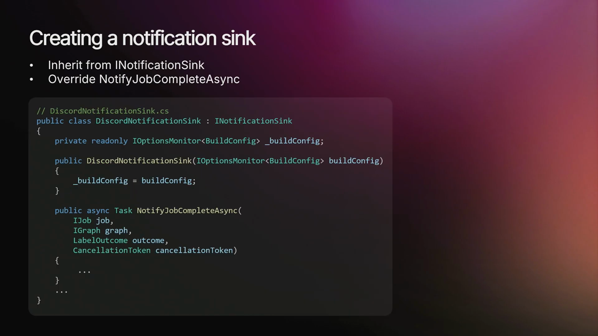

Webhook端点期望一个匹配特定模式的JSON有效负载，所以我们可以创建一些匹配该模式的类，然后稍后我们将能够将这些类序列化为JSON字符串。

在`JobNotifyComplete`函数内部，我们可以开始构建要发送的消息。首先，我们从配置中读取通知通道（我们基本上劫持这个配置变量来存储Webhook的URL）。然后我们可以准备要发送的消息，设置标题、颜色和描述。然后我们可以开始构建要发送的POST请求，首先将消息序列化为JSON，然后创建一个带有该JSON有效负载的HTTP POST请求，最后发送HTTP请求。

回到我们的Horde插件，我们可以注册这个类的单例作为通知同步。

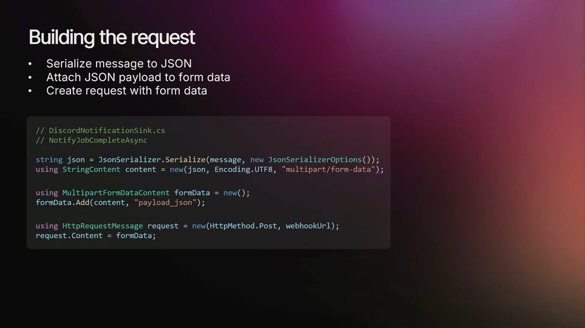

Horde为我们提供了相当多的API来获取有关任务的额外信息，可以是变更列表描述、生成的产物，或者任务是否失败或成功。Discord也有类似Markdown的语法用于样式设置，这允许我们进一步自定义消息。

---

## 十二、部署总结

### 完整的部署架构

现在我们的部署已经完成。我们选择了免费的第三方服务，如Auth0和Discord。我们还在云端部署了服务器，同时保持低成本。我们还能够集成额外的工具，如Unreal Gamesync，而几乎不需要任何努力。

### 为什么Horde适合小团队？

尽管有学习曲线，但我觉得与通用解决方案相比，使用Horde启动和运行流水线所涉及的时间和精力要少得多。这是因为原生集成、最简化的流程，以及它减少了在不同工具之间创建"胶水代码"的需要。

Horde是为规模设计的，但它显然不必如此。我们可以以低成本部署它，同时仍然满足小团队的需求。由于这些原因，我认为Horde实际上是适合几乎任何规模团队的绝佳选择。

---

## 十三、常见问题解答

### Q1: 可以使用不同版本的Horde来支持不同版本的Unreal吗？

最好使用相同版本。主要的兼容性问题是构建图。Horde将针对特定版本的构建图工作。但我发现使用5.6版本，它适用于5.5和5.4。5.3有更多问题，因为构建图中不存在artifact元素，但很容易向后移植。

### Q2: 为什么选择EC2而不是ECS？

主要是成本问题。如果我们部署多个EC2实例，我们可能会使用ECS，但在这种情况下，我们只有一个，我们可以直接运行Docker。

### Q3: EC2实例的规格是什么？

我们使用的是2核2GB实例，但我不建议这样做。我们能够这样做的唯一原因是我对Horde做了一个小修改。我建议至少4GB RAM和一点交换空间。根据文档，Epic的服务器是16GB。

### Q4: 可以使用AWS Spot实例来节省成本吗？

是的，我相信可以。我认为Epic就是这样做的。但我认为你需要担心水合工作区。

### Q5: 代理注册可以是条件性的吗？

是的，Horde会查看池以找到可用的代理。如果找不到代理，它只会等待。我认为可能也有超时。

### Q6: 可以使用Commit或Edge服务器替代代理吗？

是的，使用代理的主要原因是在本地网络上与代理一起运行它，你也可以这样做。

### Q7: 网络带宽有什么考虑？

使用预签名URL意味着代理可以直接从S3上传和下载数据，而不是通过Horde服务器传输。这有助于减少带宽限制。一个问题是水合工作区，如果你在多个代理上运行任务并且需要在代理之间移动文件，它会通过Horde传输这些文件，这可能会很慢。

---

## 结语

通过混合部署方案、合理选择云服务、利用免费第三方服务以及优化本地代理配置，小团队可以以较低成本成功部署Horde持续集成平台。虽然Horde设计用于大规模部署，但它同样适合小团队使用，特别是对于专注于Unreal Engine项目的团队。

关键要点：
- 混合部署可以平衡成本和稳定性
- 使用S3存储和预签名URL可以降低服务器负载
- 免费第三方服务（如Auth0和Discord）可以降低运营成本
- 合理配置代理硬件和软件可以最大化性能
- Horde的原生Unreal集成大大简化了部署和维护工作

希望本文对考虑部署Horde的小团队有所帮助！

---

**注：** 本文基于Unreal Fest Bali 2025的演讲内容整理，更多详细信息请参考Horde官方文档。

